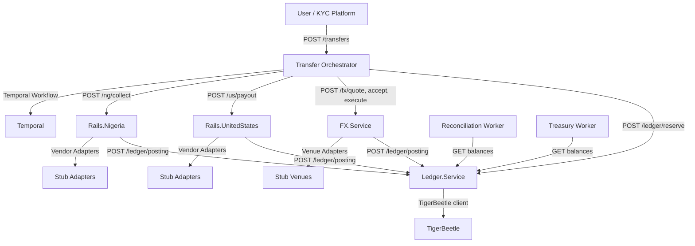
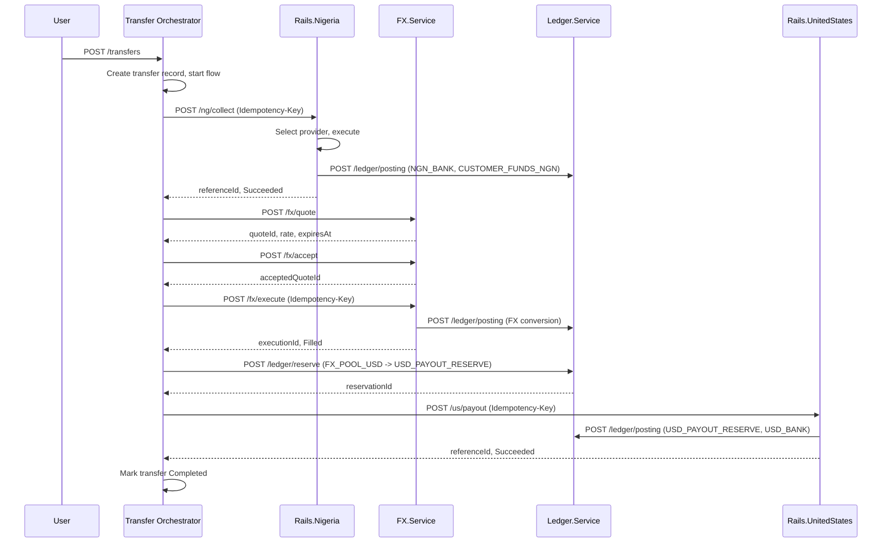
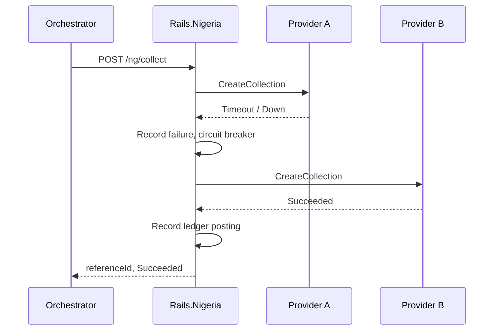
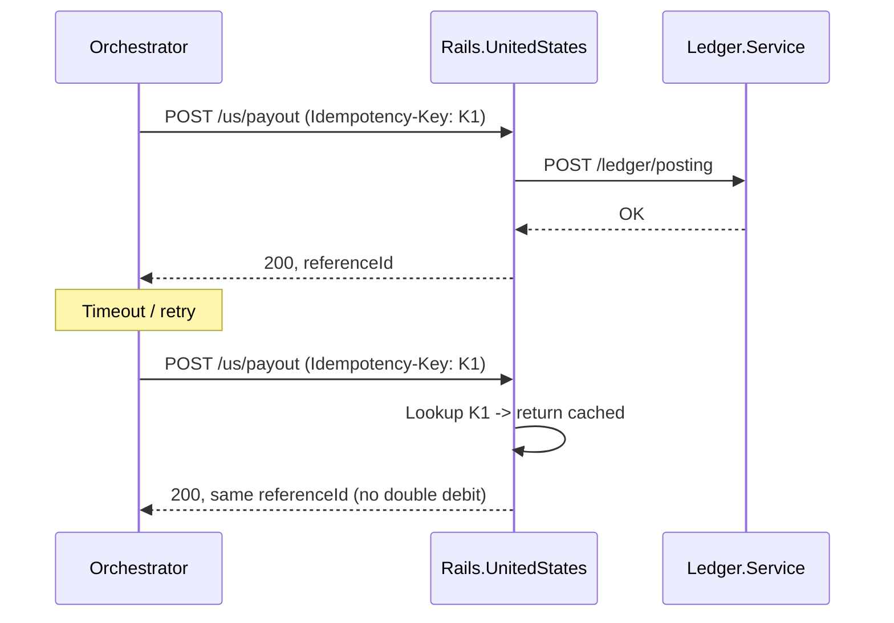

# Diagrams

## Component diagram

```mermaid
flowchart TB
    User[User / KYC Platform]
    User -->|POST /transfers| Orch[Transfer Orchestrator]
    Orch -->|Temporal Workflow| Temporal[Temporal]
    Orch -->|POST /ng/collect| NG[Rails.Nigeria]
    Orch -->|POST /us/payout| US[Rails.UnitedStates]
    Orch -->|POST /fx/quote, accept, execute| FX[FX.Service]
    Orch -->|POST /ledger/reserve| Ledger[Ledger.Service]
    NG -->|Vendor Adapters| NGAdapters[Stub Adapters]
    US -->|Vendor Adapters| USAdapters[Stub Adapters]
    FX -->|Venue Adapters| FXVenues[Stub Venues]
    NG -->|POST /ledger/posting| Ledger
    US -->|POST /ledger/posting| Ledger
    FX -->|POST /ledger/posting| Ledger
    Ledger -->|TigerBeetle client| TB[TigerBeetle]
    Rec[Reconciliation Worker] -->|GET balances| Ledger
    Treas[Treasury Worker] -->|GET balances| Ledger
```

## Happy path sequence

```mermaid
sequenceDiagram
    participant User
    participant Orch as Transfer Orchestrator
    participant NG as Rails.Nigeria
    participant FX as FX.Service
    participant Ledger as Ledger.Service
    participant US as Rails.UnitedStates

    User->>Orch: POST /transfers
    Orch->>Orch: Create transfer record, start flow
    Orch->>NG: POST /ng/collect (Idempotency-Key)
    NG->>NG: Select provider, execute
    NG->>Ledger: POST /ledger/posting (NGN_BANK, CUSTOMER_FUNDS_NGN)
    NG-->>Orch: referenceId, Succeeded
    Orch->>FX: POST /fx/quote
    FX-->>Orch: quoteId, rate, expiresAt
    Orch->>FX: POST /fx/accept
    FX-->>Orch: acceptedQuoteId
    Orch->>FX: POST /fx/execute (Idempotency-Key)
    FX->>Ledger: POST /ledger/posting (FX conversion)
    FX-->>Orch: executionId, Filled
    Orch->>Ledger: POST /ledger/reserve (FX_POOL_USD -> USD_PAYOUT_RESERVE)
    Ledger-->>Orch: reservationId
    Orch->>US: POST /us/payout (Idempotency-Key)
    US->>Ledger: POST /ledger/posting (USD_PAYOUT_RESERVE, USD_BANK)
    US-->>Orch: referenceId, Succeeded
    Orch->>Orch: Mark transfer Completed
```

## Nigeria provider down fallback

```mermaid
sequenceDiagram
    participant Orch as Orchestrator
    participant NG as Rails.Nigeria
    participant P1 as Provider A
    participant P2 as Provider B

    Orch->>NG: POST /ng/collect
    NG->>P1: CreateCollection
    P1-->>NG: Timeout / Down
    NG->>NG: Record failure, circuit breaker
    NG->>P2: CreateCollection
    P2-->>NG: Succeeded
    NG->>NG: Record ledger posting
    NG-->>Orch: referenceId, Succeeded
```

## Idempotent retry

```mermaid
sequenceDiagram
    participant Orch as Orchestrator
    participant US as Rails.UnitedStates
    participant Ledger as Ledger.Service

    Orch->>US: POST /us/payout (Idempotency-Key: K1)
    US->>Ledger: POST /ledger/posting
    Ledger-->>US: OK
    US-->>Orch: 200, referenceId
    Note over Orch: Timeout / retry
    Orch->>US: POST /us/payout (Idempotency-Key: K1)
    US->>US: Lookup K1 -> return cached
    US-->>Orch: 200, same referenceId (no double debit)
```
